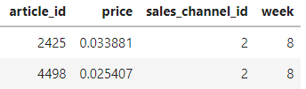
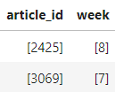

# H&M Personalized Fashion Recommendations

## 종료된 캐글 대회
- 다른 사람의 코드 분석을 통한 공부 및 혼자 해보기
- https://www.kaggle.com/competitions/h-and-m-personalized-fashion-recommendations/overview

### 목표
- 교육 데이터 기간 직후 7일 기간 동안 각 고객이 구매할 article_ids 예측
- 샘플 submission에 있는 모든 customer_id 값을 예측, 테스트 기간 동안 구매한 모든 고객은 train.csv에 구매 내역 여부 상관없이 스코어링

### 데이터
- articles.csv
    - 구매가 가능한 각 article_id에 대한 메타 정보

- customers.csv
    - 데이터셋에 있는 각 customer_id에 대한 메타 정보

- transaction_train.csv
    - 각 날짜에 대한 각 고객의 구매 및 추가 정보
    - 중복 행은 동일한 항목의 여러 구매에 해당

### 알게된 함수
- np.concatenate

        a1 = np.array([1,2,3])
        b1 = np.array([4,5,6])
        print(np.concatenate((a1, b1), axis = 0))
        # [out] : [1 2 3 4 5 6]

- agg 함수()
  - 여러개의 함수를 여러 열에 적용 가능
  - 모든열에 여러 함수를 매핑 : group객체.agg([함수1,함수2,함수3,…])
  - 각 열마다 다른 함수를 매핑 : group객체.agg({‘열1’: 함수1, ‘열2’:함수2, …})

  - 기존

  

  - 열마다 agg()

      hist_df.groupby("customer_id").agg({"article_id": list, "week": list})

  

  
   

